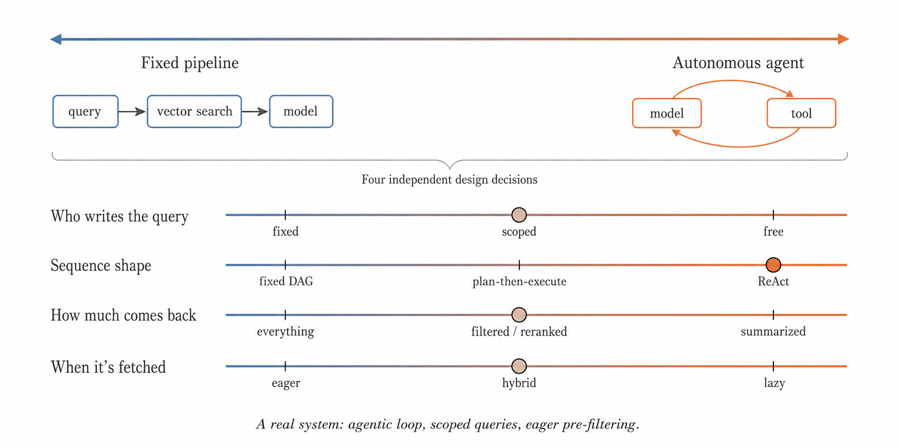

A previous post discussed tool types [Link](https://mananalabs.ai/blogs/three-ways-agents-use-tools-and-when-to-pick-each/), which explains how we can bucket tool  usage into different types based on how they're wired to the agent. It didn't discuss how information from those tools reach the context window of the model. 

In this post, we'll discuss different retriever related decisions which affect the way you design AI-first retrieval systems. In these systems, people spend a lot of time worrying about data organization: chunks size, embedding quality, etc. but we think there are "retriever" related actions which are equally important. 

Information retrieval in agents spans a spectrum. At one end are fixed retrieval pipelines. Here, the retrieval process is predefined. For example, the system embeds the user's query, retrieves the top k documents from a vector database, and passes them to the model. The model has no control over what gets retrieved or how many retrieval steps are performed. 

At the other end are autonomous agents. They decide what information to retrieve, formulate their own search queries, and make multiple retrieval calls if needed. They may search different data sources, refine their queries based on intermediate results, and stop only when they determine they have enough context to answer the question. 



Most practical systems lie somewhere between these two ends, combining fixed retrieval with varying degrees of model-driven decision making. Although they are often grouped under the same label, these systems differ substantially in architecture, capabilities, and trade-offs. This blog discusses such systems.


## The substeps involved in retrieval
Beyond how data is organized (eg. as full text, chunked text, embeddings etc), retrieving information from such data involves four separate decisions which are often overlooked. The decisions are: What gets asked, in what order, how much comes back and when. Think of them as four independent dials, each with its own settings.

### What gets asked 

At one end, the query is fixed. It's written ahead of time, maybe templated eg. with a user ID or a date, and it never changes based on what the model is thinking. We can test it in isolation. We know exactly what it will do today because it did the same thing yesterday. <br>
The query below will always fetch the invoices. It could be for a different `user_id` or for a different `start_date`. 

```python
query_sql(
    """
    SELECT *
    FROM invoices
    WHERE user_id = {user_id}
      AND created_at >= {start_date}
    """,
    user_id=user.id,
    start_date=start_date,
)
```
---
At the other end, the model writes its own queries. It picks the tool, phrases the search, looks at the results, and decides whether to go again. If you've watched a coding agent `ripgrep` its way through a repository, refining its pattern each time, you've seen this. It's powerful and it's the least predictable option on the list.

Eg: 
```python
query_sql(
    sql="{llm_generated_sql}",
)
```
---
There's a third position which is more important. Scoped. The model writes any query it wants, but the reachable surface underneath is capped. Eg, agent can read only one table in the database, the file search can run in a sandboxed directory. This is important as the scoped is the mode that still holds when things go wrong. A fixed query is safe yet rigid. A free query is flexible but unsafe. A scoped query stays safe even when model is confused or when a malicious instruction is stuffed into the document. 

Eg: Here the llm's query can only fetch invoices from a fixed tenant database. It can't access any other tenant's database.  
```python 
query_sql(
    sql="{llm_generated_sql}",
    database="{tenant_database}",   # credential only has access to one tenant
    schema="invoices",              # or a restricted schema
)
```

### In what order the questions are asked
The second decision is the sequence of the questions being asked. The first one is about query authorship, and this decision is about the shape of the whole operation. 

One sequence is a fixed Directed Acyclic Graph(DAG) where the steps are pre-defined. The model can still own the query inside each step. But it can't re-order the steps or add a new one. <br>

For example: A support agent answering "Why was I charged twice this month?" could follow following DAG:  
```python
-> fetch_invoices(user_id, month)
-> fetch_payment_events(invoice_ids)
-> generate_answer(context)
```
Every billing related question will always follow this path. If the answer lived in a refund policy document which is not a part of the DAG, then this pipeline fails to provide an answer. 

---

Another sequence is a plan-then-execute sequence. Unlike the first approach, where a series of steps is fixed for each execution, the plan is created by an agent based on the retrieval required. 

Here a planner will generate the series of steps and an executor will perform the actual task. For the same above example, "Why was I charged twice this month?", this will work in following way  : 
```python
plan = planner_llm(question)
# TODO: remove below comment and describe plan. 
# [
#   {"tool": "fetch_invoices",       "args": {"user_id": 42, "month": "2026-06"}},
#   {"tool": "fetch_payment_events", "args": {"invoice_ids": "$step_1.ids"}},
#   {"tool": "search_docs",          "args": {"query": "duplicate charge policy"}},
# ]

for step in plan: 
    results[step.id] = run(step)
```
For a given execution, say the generated plan is: 
- Fetch this month's invoices of the user.
- Fetch payment events.
- Search docs related to duplicate charge policy.

Notice how the planner produced similar actions to the previous DAG, but has an additional action of `Search docs`. For a different question like `Can I get a VAT invoice?`, the planner could come with only 2 actions. This approach is adaptable. One can also setup the system to require human approval in between the planner and execution steps.  

---
A third type is the ReAct. Instead of fixing a plan and then executing, the agent can decide the next step to take after every action. The agent repeats it until done. There is no plan upfront, everything is decided on the fly.

For example, take a look at the decision trace of an agent below for the same query, `Why was I charged twice this month?`: 
```python
Thought: I need to see the charges first.
Action:  fetch_invoices(user_id=42, month="2026-06")
Observation: Two invoices, both $29, same day.

Thought: Same amount and date. Could be a payment retry. Check gateway logs.
Action:  fetch_payment_events(invoice_ids=[881, 882])
Observation: Invoice 882 was a retry after a timeout on 881. Both settled.

Thought: Both settled means a genuine double charge. Was a refund already issued?
Action:  fetch_refunds(user_id=42)
Observation: No refunds found.

Answer: You were double charged due to a payment retry. No refund has
been issued yet, here's how to request one...

```
Notice how this approach was intelligent enough to check for refunds. For first and second methods, this step had to be a part of the DAG or the plan respectively.

---

This decision related to "Order of questions" don't go hand in hand with the first decision of "What get's asked". They both provide you the control at two different levels of granularity. You can have a ReAct loop, while still using a fixed query in each step of the sequence. The tool `fetch_invoices` in above examples can be used with all 3 different methods. If there are multiple tools each with fixed queries, agent will keep iterating to find context that is relevant to answer the question. 

---
### How much context comes back
In agentic retrieval, every token added to the model's context contributes to the cost and latency. To keep the context concise you want to be selective of how much of retrieved content gets fed to the model. 

For eg, if you fetch 50 documents, not all 50 documents have to go to the model's context. 
The standard tools you have access to, to control how much context comes to the model are: 
1. Top-K with a threshold: Say only top 5 documents, that outscore a given similarity threshold will be part of the context. If only 10 documents pass the threshold score, 5 are selected, if only 3 documents do so, only 3 are selected and rest are rejected. Re-ranking is quite common here. You fetch 10, use dedicated re-ranker to shuffle their actual closeness with the query and then select the top-5 only. 

For example, a search over a company's help center with 10,000 articles: 
```python
candidates = vector_search("duplicate charge refund", k=50)

reranked = reranker.rerank(query, candidates)

context = [d for d in reranked[:5] if d.score > 0.72]
```
---
2. Metadata: A filter can be applied on the property of data being fetched.

For example, the articles are in 5 different languages, and user is an English speaker. In that case: 
```python 
candidates = search(query, filter={"lang": "english"})
```
without the filter, the top results might be in German, which are semantically close but useless to the user.

---
3. Permission filters: The filter may require access control. It's not enough to enforce access control via prompts. The retrieval system must be designed in an appropriate way.

For example, the articles can contain some internal-only articles which are related to fraud investigation procedures. When an internal staff is requesting, the articles should retrieve those internal-only articles too. Whereas when an outside user is requesting, those articles should be excluded. 

---
4. Summarization: In multi-agentic systems, one agent may need to take care of  high volume of context. In those cases, it might not be appropriate to provide raw retrieved content into the model's context. In those cases a separate llm call is made, for summarizing all retrieved content. Which is then passed into the main model's context. It helps prevent bloating the main agent's context. It is also a popular practise with sub-agents. The sub-agents perform a series of steps to figure out some information. The main agent only sees the summarized output from the sub-agent which is required for it to proceed ahead. 

For Example: To investigate the double-charge incident, a sub-agent may be asked to investigate and read multiple payment gateway log entries, incident tickets, docs etc. The main agent requires none of those. The sub agent could come with summary like the following which is enough for main agent:  
```text
- Incident INC-444 (June 10) caused gateway timeouts which resulted in duplicate transactions. 
- Auto-refund processed for 100 accounts. 
- This user's refund not in the processed batch and hence flagged for manual review
```

### When the context comes to the model. 
The last question is related to when a model can see the context. 

Eager fetching happens before the model starts. In Classic RAG, everything the model will see is decided upfront. User makes a query -> the most relevant content is fetched -> The model includes this into its context. This approach is more reproducible and easy to reason about. It is better when you already know what model needs to know about. 

In billing question discussed above, If we know with certainty that the information related to invoices, payment history and plan is required. The following can be done
```python
context = {
    "invoices": fetch_invoices(user.id, last_n_months=3),
    "plan": fetch_plan(user.id),
    "payments": fetch_payment_events(user.id, last_n_months=3),
}
answer = llm(question, context)
```
Here, only single llm call is required which is cheaper and faster.

---
Lazy fetching tries to overcome the limitation of above approach. What if model needs something more than what was passed as the context through RAG? Can model decide to fetch something else again? Here the model can perform fetch mid-reasoning. This is usually how the modern agents operate. 

Take an example of a coding agent. When user enters a command like,  "Add status column to Results table". The agent firstly lists the files hierarchy using a tool like `tree`, using its output, it decides it needs to see content of  `models.py`, then it fetches the current implementation of `Results` table, the migration status. It then writes new version. It never needs to read what information is there in irrelevant files. 
```python
> tree src/
> cat src/models.py          # found Results table
> cat src/migrations/0042.py # checks the latest migration format
> write src/migrations/0043_add_status.py
```

---

Another pattern, that we're using in one of our projects is a combination of both. Using bm25 + kNN search over a fixed user query, we eager load the documents and save it to  some temporary text file. The agent gets reference of that file. Now, agent can use lazy loading to retrieve what information it requires from this shortlisted content by using tools like `ripgrep`. 
```python
# Eager phase: narrow 100k docs to ~50
hits = hybrid_search(user_query, bm25_weight=0.4, knn_weight=0.6, k=50)
write_to_file("/tmp/shortlist.txt", format_docs(hits))

# Lazy phase: agent works over the shortlist only
agent.run(question, tools=[grep_file, read_lines], scope="/tmp/shortlist.txt")
```

It avoids agent from having to search from a huge storage of elasticsearch knowledge base. The iterative agent search with reasoning is also more accurate but also comes with a higher cost.  This resource talks about the similar setup. [HotelQuEST, Hadad et al., 2026](https://arxiv.org/abs/2602.23949) 

## Ending Notes
These four decisions are independent. To make that concrete, here is an example of where the hybrid pipeline explained in earlier sections sits:

**What gets asked**: Scoped. The agent phrases its own ripgrep patterns, but the reachable surface is one temp file. It cannot touch the Elasticsearch cluster.

**In what order the questions are asked**: ReAct. The agent greps, reads content, and decides its next pattern from what it found. No upfront plan.

**How much context comes back**: Filtered twice. The eager phase applies top-k over hybrid scores. The lazy phase returns only matching lines instead of whole documents.

**When the context comes to the model**: Both. Eager for the shortlisting over the full corpus, lazy for everything after.

Notice the dials don't move together. The sequence is fully agentic while the query surface is tightly capped. If "how agentic is your retrieval" were one question, this system would have no answer. Its four questions, and this system answers each one differently.